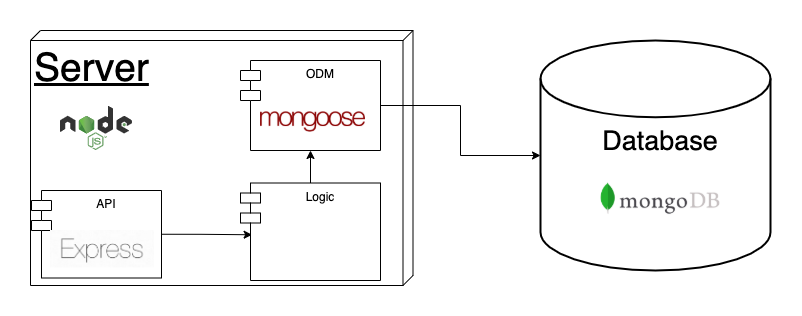

# Cellit! - Server

## Introduction
A REST API for fetching mobile devices.

## URL

[`https://cellit.herokuapp.com/`](https://cellit.herokuapp.com/)

## Endpoints
GET/phones -> returns the main info of all the devices stored in DB

GET/phones/:id -> returns all the info of a specific device

Every device object has a `href` value that leads to its details endpoint

## How to run it

### IMPORTANT!
For runing this API it is necesary the `.env` file.
For security reasons this file is not included in this repository. If you need it, ask for it! Mail me to dariofedes@protonmail.com telling me why you need it.

You will also need a Mongo database for fetching data. you can build your own locally following [this guide](https://docs.mongodb.com/guides/server/install/). You can find a .json file to populate it in `./data/populate/phones.json`.

### Install dependencies
```
$ npm i
```

### Run tests
```
$ npm test
```

### Run server
```
$ npm start
```

## Technical Description

### Block diagram

